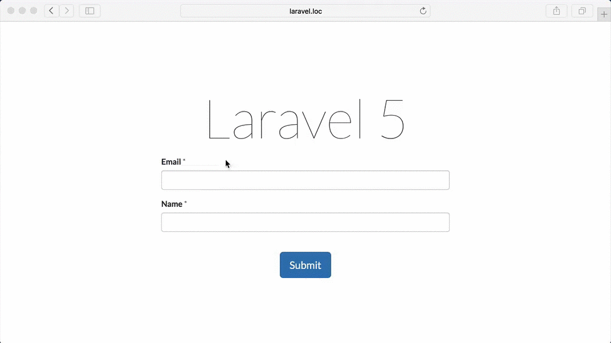

# Laravel Ajax Validation

Have you ever dreamed about having ajax validation without repeating all of the validation rules you have in your controller already in your views with some special plugins for validation? Have you ever gotten really upset while going back and forth between your controllers, views, and javascript files updating validation rules spread across your entire Laravel project? Well, guess what? Your dreams come true, and you can finally say goodbye to your pain!

# Demo



# Features

* Super easy to set up
* No need to change your existing controllers and views or to add any additional html markup
* Supports file upload inputs
* Automatically shows validation errors without any configuration
* Prevent double form submission
* Shows submitting/retry/done statuses on submit button
* Hides form, and modal window if you're using one, after succesfull submission
* Shows succesfull message
* Support configuration to change default behaviour

# Installation

```bash
bower install laravel-ajax-validation
```

Or checkout git repository.

# Usage

Include installed script in your view

```html
<script src="{{ asset('js/jquery.laravelAjaxValidation.js') }}"></script>
```

Initialize the plugin or your form

```js
$('#form').laravelAjaxValidation();
```

That's it! You're good to go!

# Configuration

Here are the options available

```js
$('#form').laravelAjaxValidation({
    // Show error list before the form
    showErrorList: false,
    // Show errors next to inputs
    showInlineErrors: true,
    // Hide form and display success message
    hideFormAfterSuccess: true,
    // Disable form submission after first successful submission
    disableReSubmit: true,
    // Rename submit button during submission
    progressButton: '<i class="fa fa-spinner fa-pulse"></i> &nbsp; Submitting',
    // Rename submit button after failed submission
    retryButton: 'Try again',
    // Rename submit button after successful submission
    doneButton: '<i class="fa fa-check"></i> &nbsp; Done' 
});
```

# Laravel set up

If you don't have your controller and view set up already here is how you do it

## Controller

Create you controller `app/Http/Controllers/FormController.php`

```php
<?php namespace App\Http\Controllers;

use Illuminate\Http\Request;
use App\Http\Requests;
use App\Http\Controllers\Controller;

class FormController extends Controller
{
    public function index()
    {
        return view('form');
    }

    public function store(Request $request)
    {
        $this->validate($request, [
            'name' => 'required',
            'email' => 'required|email',
        ]);

        // Do the magic here

        if ($request->ajax()) {
            return response()->json([
                'success' => true,
                'message' => "Thanks {$request->get('name')}!",
            ]);
        }
        else {
            return redirect()
                ->back()
                ->withMessage("Thanks {$request->get('name')}!");
        }
    }
}
```

## Routes

Add routes to your route config fi `app/Http/routes.php`

```php
Route::get('form', ['uses' => 'FormController@index']);
Route::post('form', ['uses' => 'FormController@store']);
```

## View

Create your view `resources/views/form.blade.php`

```php
    {!! Form::open(['id' => 'form']) !!}

    <?php $field = 'email'; $label = 'Email'; ?>
    <div class="form-group @if ($errors->has($field)) {{ 'has-error has-feedback' }} @endif">
        {!! Form::label($field, $label) !!} <span class="required">*</span>
        {!! Form::text($field, old($field), ['class' => 'form-control']) !!}
        @if ($errors->has($field))
            <span class="glyphicon glyphicon-remove form-control-feedback" aria-hidden="true"></span>
            <label class="error" for="{{ $field }}">{{ current($errors->get($field)) }}</label>
        @endif
    </div>

    <?php $field = 'name'; $label = 'Name'; ?>
    <div class="form-group @if ($errors->has($field)) {{ 'has-error has-feedback' }} @endif">
        {!! Form::label($field, $label) !!} <span class="required">*</span>
        {!! Form::text($field, old($field), ['class' => 'form-control']) !!}
        @if ($errors->has($field))
            <span class="glyphicon glyphicon-remove form-control-feedback" aria-hidden="true"></span>
            <label class="error" for="{{ $field }}">{{ current($errors->get($field)) }}</label>
        @endif
    </div>

    <div class="form-group text-center">
        {!! Form::button('Submit', [
            'type' => 'submit',
            'class' => 'btn btn-lg btn-submit btn-primary',
        ]) !!}
    </div>

    {!! Form::close() !!}

    <script src="https://code.jquery.com/jquery-2.1.4.js"></script>
    <script src="{{ asset('js/jquery.laravelAjaxValidation.js') }}"></script>
    <script>
        (function($) {
            $('#form').laravelAjaxValidation();
        })(window.jQuery);
    </script>
```
